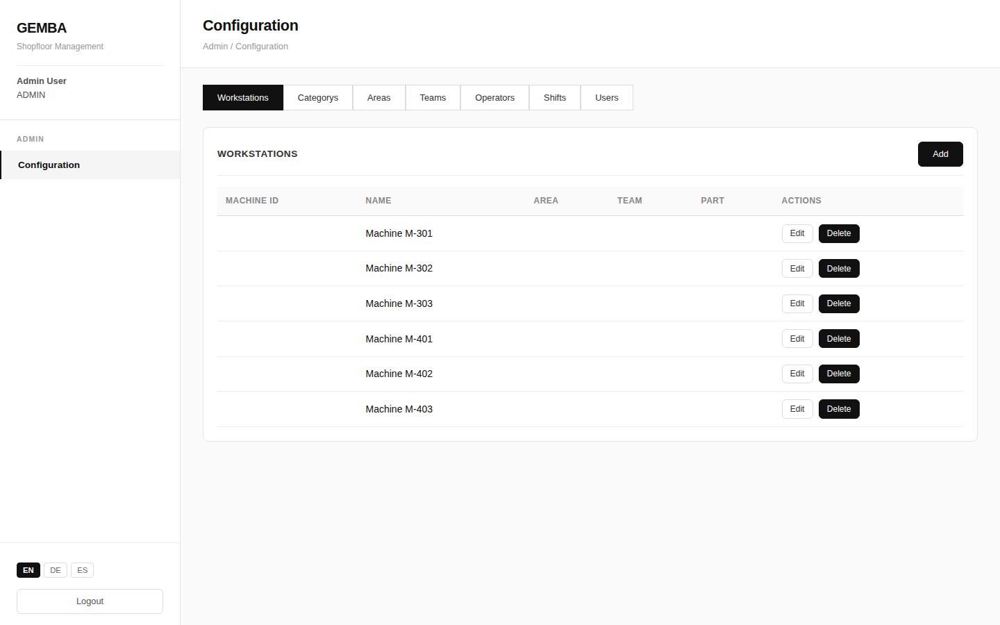
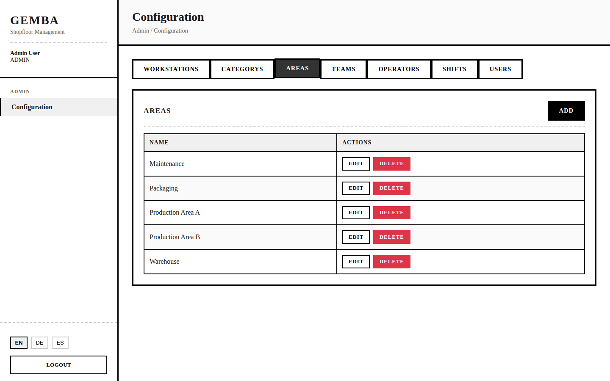
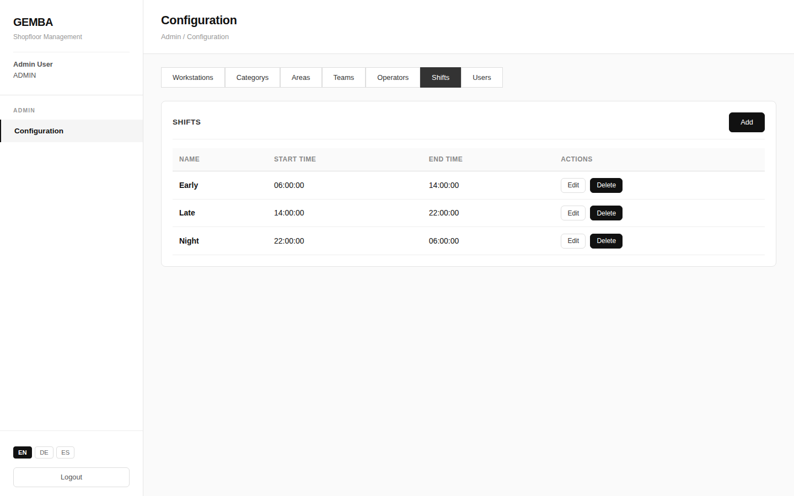
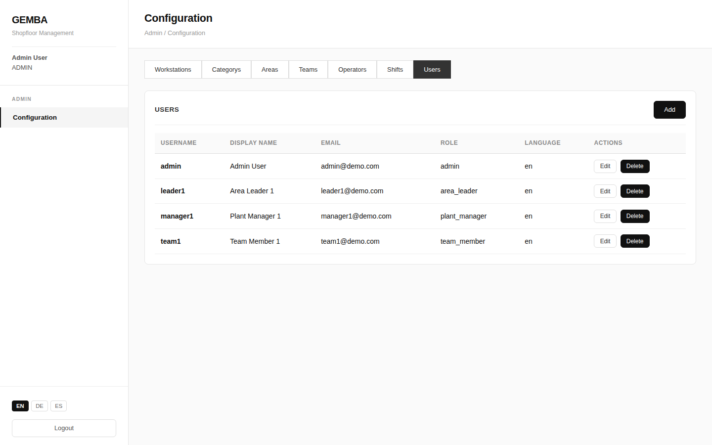

The Admin Configuration page is only accessible to users with the **admin** role. It provides tabbed management of all system configuration entities.

## Configuration Tabs



```
┌─────────────────────────────────────────────────────────┐
│  Admin › Configuration                                  │
├─────────────────────────────────────────────────────────┤
│                                                         │
│  ┌────────────┬────────────┬───────┬───────┬──────────┐ │
│  │Workstations│ Categories │ Areas │ Teams │ Operators│ │
│  ├────────────┴────────────┴───────┴───────┴──────────┤ │
│  │ ┌────────┬───────┐                                 │ │
│  │ │ Shifts │ Users │                                 │ │
│  │ └────────┴───────┘                                 │ │
│  └────────────────────────────────────────────────────┘ │
│                                                         │
└─────────────────────────────────────────────────────────┘
```

## Workstations Tab

Manage production workstations (machines).

```
┌─ Workstations ──────────────────────── [Add Workstation]┐
│                                                         │
│  ┌────────────┬──────────────┬───────┬──────┬─────┬───┐ │
│  │ Machine ID │ Name         │ Area  │ Team │ Part│   │ │
│  ├────────────┼──────────────┼───────┼──────┼─────┼───┤ │
│  │ M-101      │ Press Line 1 │ North │Alpha │PN-44│Ed │ │
│  │ M-102      │ Press Line 2 │ North │Alpha │PN-44│Ed │ │
│  │ M-201      │ CNC Mill A   │ South │ Beta │PN-55│Ed │ │
│  │ M-202      │ CNC Mill B   │ South │ Beta │PN-55│Ed │ │
│  │ M-301      │ Assembly 1   │ East  │Gamma │PN-66│Ed │ │
│  └────────────┴──────────────┴───────┴──────┴─────┴───┘ │
│                                                         │
└─────────────────────────────────────────────────────────┘
```

### Workstation Modal

```
┌─ Add/Edit Workstation ──────────────────────── [X] ─────┐
│                                                         │
│  Machine ID              Name                           │
│  ┌──────────────┐        ┌──────────────────────────┐   │
│  │ M-501        │        │ Welding Station 1        │   │
│  └──────────────┘        └──────────────────────────┘   │
│                                                         │
│  Area                    Team                           │
│  ┌──────────────┐        ┌──────────────┐               │
│  │ West       ▾ │        │ Delta      ▾ │               │
│  └──────────────┘        └──────────────┘               │
│                                                         │
│  Part Number                                            │
│  ┌──────────────────────────────────────────────────┐   │
│  │ PN-7701                                          │   │
│  └──────────────────────────────────────────────────┘   │
│                                                         │
│                                [Cancel]  [Save]         │
└─────────────────────────────────────────────────────────┘
```

## Categories, Areas, Teams, Operators Tabs

These tabs share the same simple list interface — a table with a single **Name** column.



```
┌─ Categories ──────────────────────────── [Add Category] ┐
│                                                         │
│  ┌──────────────────────────────────────────────┬─────┐ │
│  │ Name                                         │     │ │
│  ├──────────────────────────────────────────────┼─────┤ │
│  │ Mechanical                                   │Ed Dl│ │
│  │ Electrical                                   │Ed Dl│ │
│  │ Quality                                      │Ed Dl│ │
│  │ Safety                                       │Ed Dl│ │
│  │ Process                                      │Ed Dl│ │
│  │ Other                                        │Ed Dl│ │
│  └──────────────────────────────────────────────┴─────┘ │
│                                                         │
└─────────────────────────────────────────────────────────┘
```

The modal for these tabs has a single text input for the item name.

## Shifts Tab

Manage shift definitions with start and end times.



```
┌─ Shifts ───────────────────────────────── [Add Shift]  ─┐
│                                                         │
│  ┌────────────────┬────────────┬──────────┬───────────┐ │
│  │ Name           │ Start Time │ End Time │ Actions   │ │
│  ├────────────────┼────────────┼──────────┼───────────┤ │
│  │ Morning        │ 06:00      │ 14:00    │ Edit  Del │ │
│  │ Afternoon      │ 14:00      │ 22:00    │ Edit  Del │ │
│  │ Night          │ 22:00      │ 06:00    │ Edit  Del │ │
│  └────────────────┴────────────┴──────────┴───────────┘ │
│                                                         │
└─────────────────────────────────────────────────────────┘
```

### Shift Modal

```
┌─ Add/Edit Shift ────────────────────────────── [X] ─────┐
│                                                         │
│  Shift Name                                             │
│  ┌───────────────────────────────────────────────────┐  │
│  │ Morning                                           │  │
│  └───────────────────────────────────────────────────┘  │
│                                                         │
│  Start Time              End Time                       │
│  ┌──────────────┐        ┌──────────────┐               │
│  │ 06:00        │        │ 14:00        │               │
│  └──────────────┘        └──────────────┘               │
│                                                         │
│                                [Cancel]  [Save]         │
└─────────────────────────────────────────────────────────┘
```

## Users Tab

Manage system users and their roles. Only visible to admin users.



```
┌─ Users ───────────────────────────────── [Add User]  ───┐
│                                                         │
│  ┌──────────┬─────────────┬────────────┬───────┬──────┐ │
│  │ Username │ Display Name│ Email      │ Role  │      │ │
│  ├──────────┼─────────────┼────────────┼───────┼──────┤ │
│  │ team1    │ Team One    │ t1@co.com  │ Team  │Ed Del│ │
│  │ leader1  │ Leader One  │ l1@co.com  │ Area  │Ed Del│ │
│  │ manager1 │ Manager One │ m1@co.com  │ Plant │Ed Del│ │
│  │ admin    │ Admin       │ a@co.com   │ Admin │Ed Del│ │
│  └──────────┴─────────────┴────────────┴───────┴──────┘ │
│                                                         │
└─────────────────────────────────────────────────────────┘
```

### User Modal

```
┌─ Add/Edit User ─────────────────────────────── [X] ─────┐
│                                                         │
│  Username                    Display Name               │
│  ┌──────────────────┐        ┌──────────────────┐       │
│  │ operator1        │        │ Jane Operator    │       │
│  └──────────────────┘        └──────────────────┘       │
│                                                         │
│  Email                                                  │
│  ┌───────────────────────────────────────────────────┐  │
│  │ jane.operator@company.com                         │  │
│  └───────────────────────────────────────────────────┘  │
│                                                         │
│  Role                        Language                   │
│  ┌──────────────────┐        ┌──────────────────┐       │
│  │ Team Member    ▾ │        │ English        ▾ │       │
│  └──────────────────┘        └──────────────────┘       │
│                                                         │
│                                [Cancel]  [Save]         │
└─────────────────────────────────────────────────────────┘
```

## Role Definitions

| Role | Access Level | Description |
|------|-------------|-------------|
| **Team Member** | L1 | Production data entry, issue creation, safety logging |
| **Area Leader** | L2 | Area management, escalation, resolution, Gemba walks |
| **Plant Manager** | L3 | Plant-wide visibility, final escalation level |
| **Admin** | All | Full system access including configuration |
