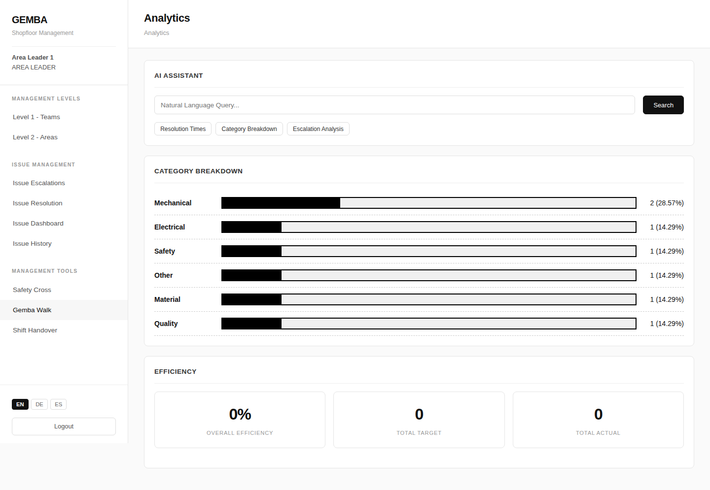

The Analytics page provides data-driven insights into plant operations with an AI assistant for natural-language queries and pre-built reports.

## Analytics Page



```
┌─────────────────────────────────────────────────────────┐
│  Analytics                                              │
├─────────────────────────────────────────────────────────┤
│                                                         │
│  ┌─ AI Assistant ───────────────────────────────────┐   │
│  │                                                  │   │
│  │  Ask a question about your plant data:           │   │
│  │  ┌──────────────────────────────────┐ [Search]   │   │
│  │  │ Show me all high priority issues │            │   │
│  │  │ from last week                   │            │   │
│  │  └──────────────────────────────────┘            │   │
│  │                                                  │   │
│  │  Quick Reports:                                  │   │
│  │  [Resolution Times] [Category Breakdown]         │   │
│  │  [Escalation Analysis]                           │   │
│  │                                                  │   │
│  └──────────────────────────────────────────────────┘   │
│                                                         │
└─────────────────────────────────────────────────────────┘
```

## AI Query Results

After submitting a query, the AI returns matching results with relevance scores.

```
┌─ AI Results ────────────────────────────────────────────┐
│                                                         │
│  Summary: Found 4 high-priority issues from the past    │
│  7 days across 2 areas.                                 │
│                                                         │
│  ┌──────────────────────────────────────────────────┐   │
│  │ #1042 — Hydraulic leak on press arm              │   │
│  │ [OPEN]  Relevance: 95%  Category: Mechanical     │   │
│  ├──────────────────────────────────────────────────┤   │
│  │ #1035 — Recurring quality deviation line 2       │   │
│  │ [ESCALATED]  Relevance: 92%  Category: Quality   │   │
│  ├──────────────────────────────────────────────────┤   │
│  │ #1037 — Label printer down                       │   │
│  │ [RESOLVED]  Relevance: 88%  Category: Electrical │   │
│  ├──────────────────────────────────────────────────┤   │
│  │ #1033 — Forklift damage                          │   │
│  │ [RESOLVED]  Relevance: 85%  Category: Safety     │   │
│  └──────────────────────────────────────────────────┘   │
│                                                         │
└─────────────────────────────────────────────────────────┘
```

## Category Breakdown

A visual bar chart showing issue distribution by category.

```
┌─ Category Breakdown ────────────────────────────────────┐
│                                                         │
│  Mechanical   ████████████████████████████░░░  18  27%  │
│  Quality      ██████████████████████░░░░░░░░  15  22%  │
│  Safety       ████████████████░░░░░░░░░░░░░░  12  18%  │
│  Electrical   ████████████░░░░░░░░░░░░░░░░░░   9  13%  │
│  Process      ██████████░░░░░░░░░░░░░░░░░░░░   8  12%  │
│  Other        ██████░░░░░░░░░░░░░░░░░░░░░░░░   5   8%  │
│                                                         │
└─────────────────────────────────────────────────────────┘
```

## Resolution Times

Key metrics on how quickly issues are being resolved.

```
┌─ Resolution Times ──────────────────────────────────────┐
│                                                         │
│  Average          Fastest         Slowest         Total │
│  ┌──────────┐    ┌──────────┐    ┌──────────┐    ┌───┐ │
│  │  18.4 h  │    │   2.1 h  │    │  72.0 h  │    │ 50│ │
│  │ Average  │    │ Fastest  │    │ Slowest  │    │Rsl│ │
│  └──────────┘    └──────────┘    └──────────┘    └───┘ │
│                                                         │
└─────────────────────────────────────────────────────────┘
```

## Production Efficiency

Plant-wide production performance summary.

```
┌─ Production Efficiency ─────────────────────────────────┐
│                                                         │
│  Overall Efficiency      Total Target      Total Actual │
│  ┌───────────┐           ┌──────────┐      ┌──────────┐│
│  │   91.4%   │           │   7200   │      │   6581   ││
│  └───────────┘           └──────────┘      └──────────┘│
│                                                         │
└─────────────────────────────────────────────────────────┘
```
