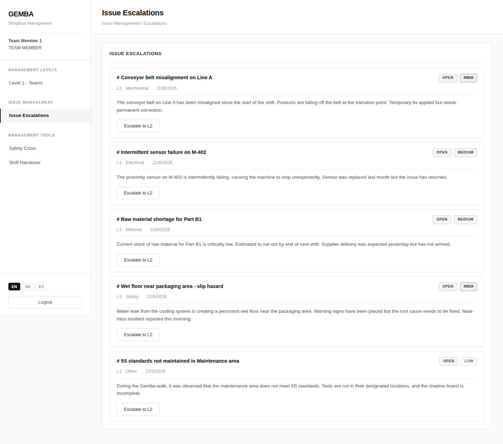
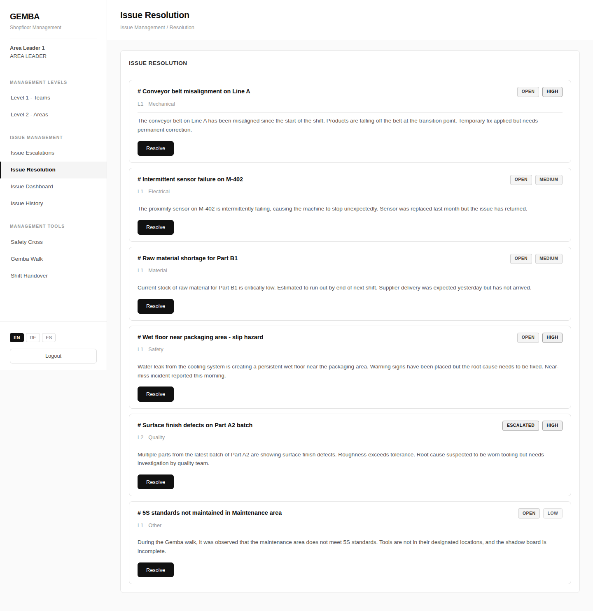
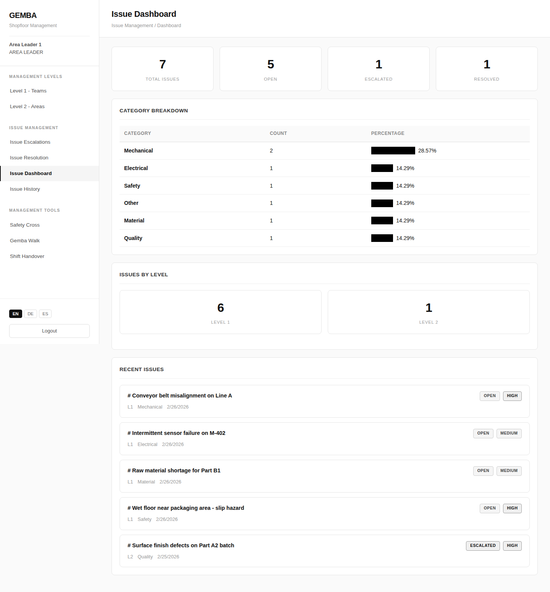
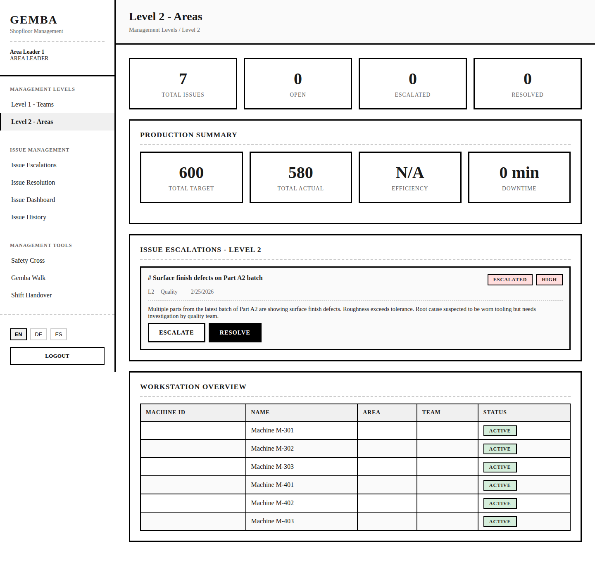

The issue management section provides four dedicated pages for tracking the full lifecycle of shopfloor issues.

## Escalations Page

Lists all open issues that can be escalated to the next level.



```
┌─────────────────────────────────────────────────────────┐
│  Issue Management › Escalations                         │
├─────────────────────────────────────────────────────────┤
│                                                         │
│  ┌─ Open Issues ────────────────────────────────────┐   │
│  │                                                  │   │
│  │  #1042 — Hydraulic leak on press arm             │   │
│  │  [OPEN] [HIGH]  L1  Mechanical  Area: North      │   │
│  │  2026-02-24                                      │   │
│  │  Oil dripping from the left cylinder seal         │   │
│  │                                                  │   │
│  │  ┌─ AI Suggestion ────────────────────────────┐  │   │
│  │  │ Suggested Level: L2  Confidence: 87%       │  │   │
│  │  │ Reason: Hydraulic issues require area       │  │   │
│  │  │ leader assessment for maintenance.          │  │   │
│  │  └───────────────────────────────────────────┘  │   │
│  │                                                  │   │
│  │                          [Escalate to L2]        │   │
│  │                                                  │   │
│  │  #1038 — Missing safety guard on conveyor        │   │
│  │  [OPEN] [MEDIUM]  L1  Safety  Area: North        │   │
│  │  2026-02-23                                      │   │
│  │                                                  │   │
│  │                          [Escalate to L2]        │   │
│  │                                                  │   │
│  └──────────────────────────────────────────────────┘   │
│                                                         │
└─────────────────────────────────────────────────────────┘
```

**Escalate button visibility:** Only shown when the user's role level is >= the issue's current level, and the issue level is below L3.

## Resolution Page

Shows issues that need resolution, with a detailed resolution form.



```
┌─────────────────────────────────────────────────────────┐
│  Issue Management › Resolution                          │
├─────────────────────────────────────────────────────────┤
│                                                         │
│  ┌─ Issues Requiring Resolution ────────────────────┐   │
│  │                                                  │   │
│  │  #1042 — Hydraulic leak on press arm             │   │
│  │  [OPEN] [HIGH]  L2  Mechanical  Area: North      │   │
│  │  Oil dripping from the left cylinder seal         │   │
│  │                                                  │   │
│  │                                    [Resolve]     │   │
│  └──────────────────────────────────────────────────┘   │
│                                                         │
└─────────────────────────────────────────────────────────┘
```

The resolution modal includes an **Impact Assessment** section:

```
┌─ Resolve Issue ─────────────────────────────── [X] ─────┐
│                                                         │
│  Root Cause *                                           │
│  ┌───────────────────────────────────────────────────┐  │
│  │ e.g., Worn bearing due to lack of lubrication     │  │
│  └───────────────────────────────────────────────────┘  │
│                                                         │
│  Corrective Actions *                                   │
│  ┌───────────────────────────────────────────────────┐  │
│  │ e.g., Replaced bearing, restored lubrication      │  │
│  └───────────────────────────────────────────────────┘  │
│                                                         │
│  Preventive Measures                                    │
│  ┌───────────────────────────────────────────────────┐  │
│  │ e.g., Weekly lubrication check added to PM plan   │  │
│  └───────────────────────────────────────────────────┘  │
│                                                         │
│  ── Impact Assessment ──                                │
│                                                         │
│  Impact Description                                     │
│  ┌───────────────────────────────────────────────────┐  │
│  │ e.g., Reduced unplanned downtime by 2 hrs/week   │  │
│  └───────────────────────────────────────────────────┘  │
│                                                         │
│  Estimated Savings ($)                                  │
│  ┌───────────────────────────────────────────────────┐  │
│  │ 5000                                              │  │
│  └───────────────────────────────────────────────────┘  │
│                                                         │
│                                [Cancel]  [Resolve]      │
└─────────────────────────────────────────────────────────┘
```

## Dashboard

The dashboard provides a high-level overview of all issues with breakdowns by category and level.



```
┌─────────────────────────────────────────────────────────┐
│  Issue Management › Dashboard                           │
├─────────────────────────────────────────────────────────┤
│                                                         │
│  ┌─ Overview ───────────────────────────────────────┐   │
│  │  Total Issues    Open    Escalated    Resolved   │   │
│  │  ┌────┐         ┌────┐  ┌────┐       ┌────┐     │   │
│  │  │ 67 │         │ 12 │  │  5 │       │ 50 │     │   │
│  │  └────┘         └────┘  └────┘       └────┘     │   │
│  └──────────────────────────────────────────────────┘   │
│                                                         │
│  ┌─ Category Breakdown ─────────────────────────────┐   │
│  │                                                  │   │
│  │  Category      Count   Percentage                │   │
│  │  Mechanical     18     ████████████░░░░░  27%    │   │
│  │  Quality        15     ██████████░░░░░░░  22%    │   │
│  │  Safety         12     ████████░░░░░░░░░  18%    │   │
│  │  Electrical      9     ██████░░░░░░░░░░░  13%    │   │
│  │  Process         8     █████░░░░░░░░░░░░  12%    │   │
│  │  Other           5     ███░░░░░░░░░░░░░░   8%    │   │
│  │                                                  │   │
│  └──────────────────────────────────────────────────┘   │
│                                                         │
│  ┌─ Issues by Level ──┐  ┌─ Recent Issues ──────────┐   │
│  │                    │  │                          │   │
│  │  L1     L2     L3  │  │ #1042 Hydraulic leak     │   │
│  │ ┌──┐  ┌──┐  ┌──┐  │  │ #1041 5S audit finding   │   │
│  │ │32│  │25│  │10│  │  │ #1040 Conveyor jam       │   │
│  │ └──┘  └──┘  └──┘  │  │ #1039 Quality deviation  │   │
│  │                    │  │ #1038 Missing guard      │   │
│  └────────────────────┘  └──────────────────────────┘   │
│                                                         │
└─────────────────────────────────────────────────────────┘
```

Clicking any issue in the "Recent Issues" list opens a **read-only detail modal** showing all issue fields, AI suggestions, resolution details, and escalation history.

## Issue History

A searchable, filterable table of all issues with pagination.



```
┌─────────────────────────────────────────────────────────┐
│  Issue Management › History                             │
├─────────────────────────────────────────────────────────┤
│                                                         │
│  ┌─ Filters ────────────────────────────────────────┐   │
│  │ Search: ┌──────────┐  Status: ┌──────────┐      │   │
│  │         │          │          │ All    ▾  │      │   │
│  │         └──────────┘          └──────────┘      │   │
│  │ Priority: ┌──────────┐ Category: ┌──────────┐   │   │
│  │           │ All    ▾  │          │ All    ▾  │   │   │
│  │           └──────────┘          └──────────┘   │   │
│  └──────────────────────────────────────────────────┘   │
│                                                         │
│  ┌─────┬──────────────┬──┬──────────┬──────┬──────┬───┐ │
│  │  #  │ Title        │L │ Category │Prior.│Status│   │ │
│  ├─────┼──────────────┼──┼──────────┼──────┼──────┼───┤ │
│  │1042 │ Hydraulic    │L2│Mechanical│[HIGH]│[OPEN]│View│ │
│  │1041 │ 5S finding   │L1│Process   │[LOW] │[OPEN]│View│ │
│  │1040 │ Conveyor jam │L1│Mechanical│[MED] │[RSLV]│View│ │
│  │1039 │ Quality dev. │L2│Quality   │[MED] │[ESCL]│View│ │
│  │...  │ ...          │  │          │      │      │   │ │
│  └─────┴──────────────┴──┴──────────┴──────┴──────┴───┘ │
│                                                         │
│                         [< Previous]  1 / 4  [Next >]   │
│                                                         │
└─────────────────────────────────────────────────────────┘
```

Clicking **View** opens the issue detail modal with full edit capability — all fields (title, description, category, area, priority, level, status, source, contact) can be modified.
