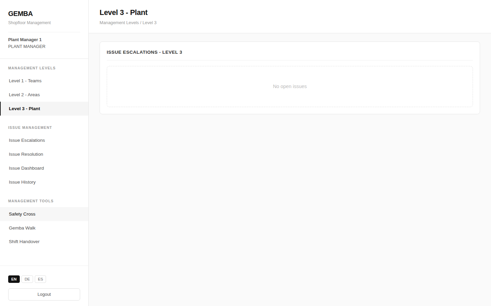

The Level 3 page gives **plant managers** a holistic view of the entire plant — issue distribution across levels, production efficiency, and the most critical escalated issues requiring attention.

## Plant Overview



```
┌─────────────────────────────────────────────────────────┐
│  Level 3 › Plant View                                   │
├─────────────────────────────────────────────────────────┤
│                                                         │
│  ┌─ Plant Overview ─────────────────────────────────┐   │
│  │                                                  │   │
│  │  Total Issues    Open    Escalated    Resolved   │   │
│  │  ┌────┐         ┌────┐  ┌────┐       ┌────┐     │   │
│  │  │ 67 │         │ 12 │  │  5 │       │ 50 │     │   │
│  │  └────┘         └────┘  └────┘       └────┘     │   │
│  │                                                  │   │
│  └──────────────────────────────────────────────────┘   │
│                                                         │
│  ┌─ Issues by Level ──┐  ┌─ Production Efficiency ──┐   │
│  │                    │  │                          │   │
│  │  L1     L2     L3  │  │  Overall Efficiency      │   │
│  │ ┌──┐  ┌──┐  ┌──┐  │  │  ┌───────┐               │   │
│  │ │32│  │25│  │10│  │  │  │ 91.4% │               │   │
│  │ └──┘  └──┘  └──┘  │  │  └───────┘               │   │
│  │                    │  │                          │   │
│  │                    │  │  Target    Actual        │   │
│  │                    │  │  ┌──────┐  ┌──────┐      │   │
│  │                    │  │  │ 7200 │  │ 6581 │      │   │
│  │                    │  │  └──────┘  └──────┘      │   │
│  └────────────────────┘  └──────────────────────────┘   │
│                                                         │
└─────────────────────────────────────────────────────────┘
```

## Level 3 Escalated Issues

Issues that have been escalated to the plant level appear here for final resolution.

```
┌─ Level 3 Escalated Issues ──────────────────────────────┐
│                                                         │
│  ┌─────────────────────────────────────────────────┐    │
│  │ #1042 — Hydraulic leak on press arm             │    │
│  │ [ESCALATED] [HIGH]  L3  Mechanical  Area: North │    │
│  │ 2026-02-24                                      │    │
│  │ Oil dripping from the left cylinder seal         │    │
│  │                                                  │    │
│  │                                    [Resolve]     │    │
│  └─────────────────────────────────────────────────┘    │
│                                                         │
│  ┌─────────────────────────────────────────────────┐    │
│  │ #1035 — Recurring quality deviation line 2      │    │
│  │ [ESCALATED] [HIGH]  L3  Quality  Area: South    │    │
│  │ 2026-02-22                                      │    │
│  │ SPC data shows Cpk dropping below 1.0           │    │
│  │                                                  │    │
│  │                                    [Resolve]     │    │
│  └─────────────────────────────────────────────────┘    │
│                                                         │
└─────────────────────────────────────────────────────────┘
```

## Recent Activity

A table of the latest 10 issues provides a quick pulse on plant activity.

```
┌─ Recent Activity ───────────────────────────────────────┐
│                                                         │
│  ┌─────┬─────────────────────┬──────────┬────────┬────┐ │
│  │  #  │ Title               │ Status   │Priority│Date│ │
│  ├─────┼─────────────────────┼──────────┼────────┼────┤ │
│  │1042 │ Hydraulic leak      │[ESCALATD]│ [HIGH] │2/24│ │
│  │1041 │ 5S audit finding    │ [OPEN]   │ [LOW]  │2/24│ │
│  │1040 │ Conveyor jam        │[RESOLVED]│ [MED]  │2/23│ │
│  │1039 │ Quality deviation   │[ESCALATD]│ [MED]  │2/23│ │
│  │1038 │ Missing guard       │ [OPEN]   │ [MED]  │2/23│ │
│  │1037 │ Label printer down  │[RESOLVED]│ [HIGH] │2/22│ │
│  │1036 │ Tooling wear        │[RESOLVED]│ [LOW]  │2/22│ │
│  │1035 │ SPC Cpk deviation   │[ESCALATD]│ [HIGH] │2/22│ │
│  │1034 │ Air leak station 5  │[RESOLVED]│ [MED]  │2/21│ │
│  │1033 │ Forklift damage     │[RESOLVED]│ [HIGH] │2/21│ │
│  └─────┴─────────────────────┴──────────┴────────┴────┘ │
│                                                         │
└─────────────────────────────────────────────────────────┘
```

**Badge colors:**
- Status: OPEN = yellow, ESCALATED = red, RESOLVED = green
- Priority: LOW = gray, MEDIUM = yellow, HIGH = red
