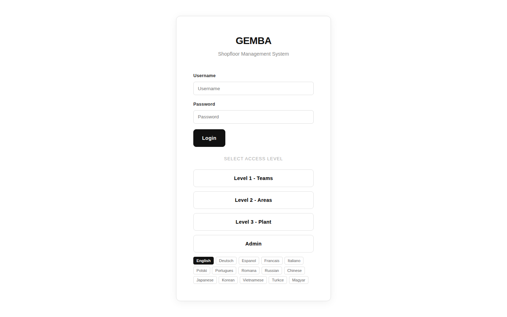

The login page is the entry point to the application. It supports username/password authentication and provides quick-access demo buttons for testing.

## Login Screen



```
┌─────────────────────────────────────────────────────────┐
│                                                         │
│           GEMBA - Shopfloor Management System           │
│                                                         │
│         ┌─────────────────────────────────┐             │
│         │                                 │             │
│         │  Username                       │             │
│         │  ┌───────────────────────────┐  │             │
│         │  │ team1                     │  │             │
│         │  └───────────────────────────┘  │             │
│         │                                 │             │
│         │  Password                       │             │
│         │  ┌───────────────────────────┐  │             │
│         │  │ ••••••••                  │  │             │
│         │  └───────────────────────────┘  │             │
│         │                                 │             │
│         │  ┌───────────────────────────┐  │             │
│         │  │         Sign In           │  │             │
│         │  └───────────────────────────┘  │             │
│         │                                 │             │
│         │  ── Quick Login ──              │             │
│         │                                 │             │
│         │  [Level 1 Teams] [Level 2 Areas]│             │
│         │  [Level 3 Plant] [Admin       ] │             │
│         │                                 │             │
│         │  Language: [EN ▾]               │             │
│         │                                 │             │
│         └─────────────────────────────────┘             │
│                                                         │
└─────────────────────────────────────────────────────────┘
```

## Demo Credentials

The application includes quick-login buttons for demo users:

| Button | Username | Password | Role |
|--------|----------|----------|------|
| Level 1 Teams | `team1` | `demo123` | Team Member |
| Level 2 Areas | `leader1` | `demo123` | Area Leader |
| Level 3 Plant | `manager1` | `demo123` | Plant Manager |
| Admin | `admin` | `demo123` | Admin |

## Language Selection

A language selector at the bottom of the login form supports 15 languages:

EN, DE, ES, FR, IT, PL, PT, RO, RU, ZH, JA, KO, VI, TR, HU

The selected language is applied across the entire application interface after login.

## Authentication Flow

1. User enters credentials or clicks a quick-login button
2. Backend validates credentials and returns a JWT token
3. Token is stored in the browser and sent with all subsequent API requests
4. Users are redirected to their default page based on role level
